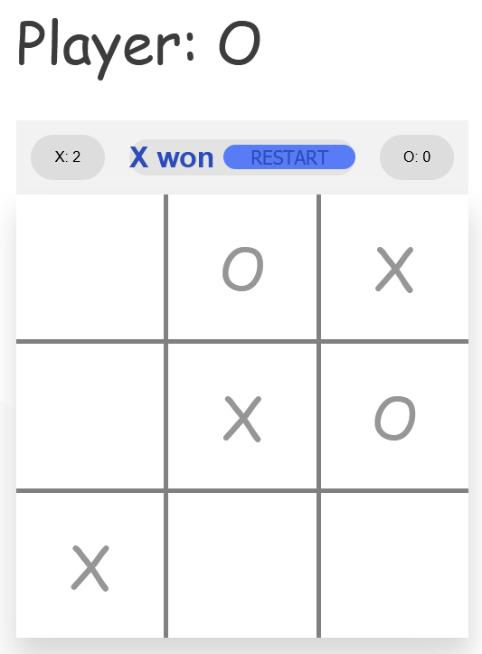

# Tic Tac Toe

-  An app to play Tic-Tac-Toe around with another person.

# Background

I've been struggling over the months to find out a way to accomplish this app. I do my upmost to think without tutorials fill my mind of a someone's code. In fact, I try to get there by myself. I've realized with this app that I can build awesome stuff, even using vanilla js.

# Challenges

-  [x] Make it works.
-  [x] Build an board animation that looks like Google's tic-tac-toe one.
-  [x] Try to split the script into very small functions.
-  [x] Use css grid to build up the board
-  [x] Make it responsive
-  [x] Apply the player's points, as well as Tie/Winner contrast style.
-  [ ] Apply the functionality of the computer play with the player.
-  [ ] Stand out the steps of the winner on the board.

made with :heart:
